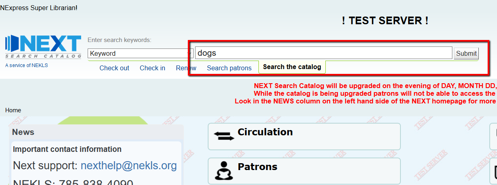
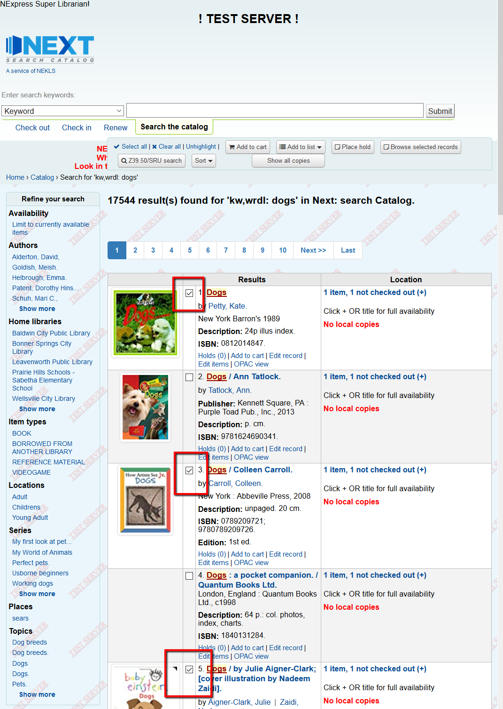
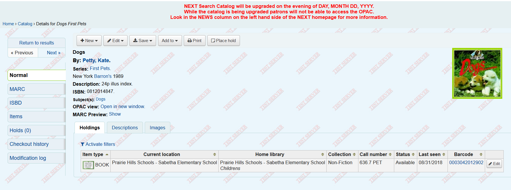
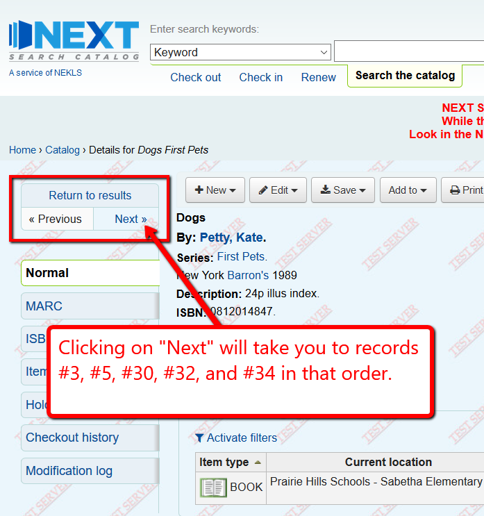

Browse search records
=====================

In the staff client you can now select records from multiple pages and browse those records.

To demonstrate, do a search for dogs:

Then click the checkbox for records #1, #3, and #5.

Then go to page 2 and click the checkbox for record #30, #32, and #34.

.. image:: images/080.png

Then click on the new button "Browse selected records"

.. image:: images/090.png

You will be shown record #1.

Clicking on the Next button will take you through all of the records you selected.

After you've clicked on multiple checkboxes from multiple pages and then click "Add to cart" or "Add to list," all of the items you've selected from all pages will be added to the list or the cart.

.. image:: images/120.png
