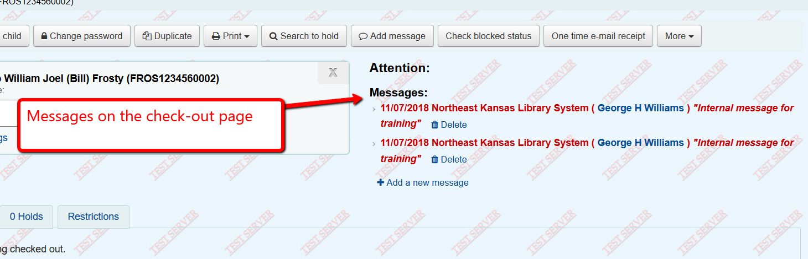
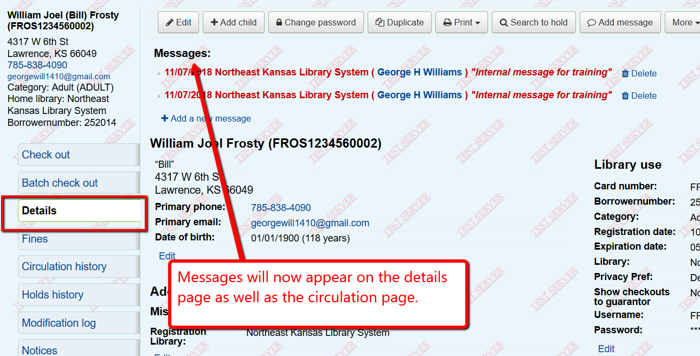
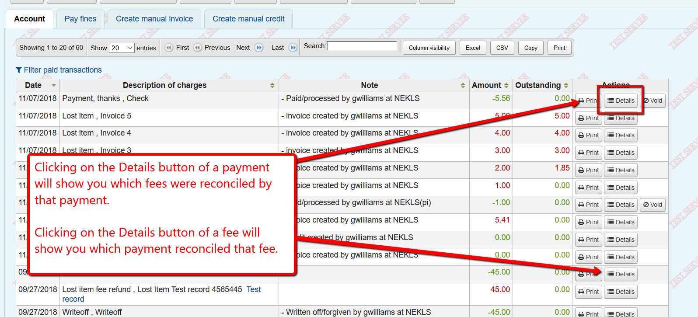
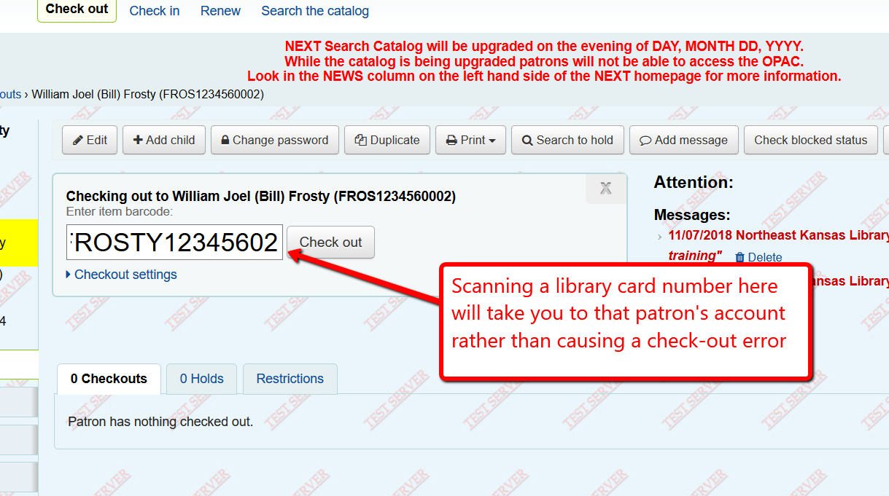

Patron record changes
=====================

Borrower number display
-----------------------

Each patron record has a unique number assigned to their account that never changes.  This number has always been in the URL for the patron account.  Now it will display on the screen.

.. image:: images/140.png

Messages on details page
------------------------

Patron messages have not appeared on the patron's details page in the past.  They will begin to do so after the upgrade to 18.05.

Changes to the checkout table
-----------------------------

The checkout table will show an item type count at the top of the table.
Additionally, new output buttons will appear to allow you to export data from the checkouts table in several formats.

.. image:: images/170.png

Changes to fines/fees
---------------------

There is now a drop-down menu to indicate payment types when paying a fee.

.. image:: images/180.png

You can now export the patron's fines/fees information in several formats.

.. image:: images/190.png

You can "Void" a payment.  This is similar to the old "Reverse" button but "Void" works by removing a previous payment rather than creating a new line in the accounts table - which should eliminate the error problems that "Reverse" was causing.

.. image:: images/190.png

You can view the details of a fee or a payment.
Details for a payment show which fees the payment was applied to.
Details for a fee show which payments were applied to it (if any).

.. image:: images/220.png

.. image:: images/230.png

Auto-Switch from checkout to new patron
---------------------------------------

If you scan a library card when checking out items to a patron, the system will automatically switch from checking out to the new patron.

.. image:: images/250.png

Tool to merge duplicate patrons
-------------------------------

NEKLS staff will have the ability to merge duplicate patron records if appropriate.

If you find two patron accounts that appear to be the same patron, contact nexthelp@nekls.org with the library card numbers of the patrons you believe are duplicates and, if appropriate, we can merge the two accounts.

Merging combines many fields. from multiple accounts into 1 patron record such as fines/fees/circulation history/messages.  Library card numbers, multiple addresses, multiple phone numbers, and some other data cannot be combined.
